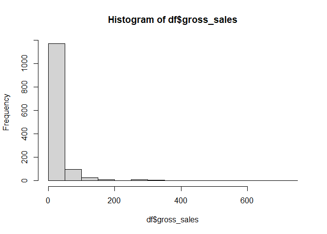

    df <- read_excel("Blacksheepgastronomy Sales data 2019-YTD.xlsm")

    summary(df)

    ##     month           billing_city       product_title      api_client_title   billing_region         orders      
    ##  Length:1323        Length:1323        Length:1323        Length:1323        Length:1323        Min.   :0.0000  
    ##  Class :character   Class :character   Class :character   Class :character   Class :character   1st Qu.:0.0000  
    ##  Mode  :character   Mode  :character   Mode  :character   Mode  :character   Mode  :character   Median :1.0000  
    ##                                                                                                 Mean   :0.6009  
    ##                                                                                                 3rd Qu.:1.0000  
    ##                                                                                                 Max.   :5.0000  
    ##   gross_sales        returns           total_sales     units_per_transaction ordered_item_quantity
    ##  Min.   :  0.00   Min.   :-720.0000   Min.   :-59.41   Min.   :  0.000       Min.   :  0.000      
    ##  1st Qu.:  0.00   1st Qu.:   0.0000   1st Qu.:  7.56   1st Qu.:  0.000       1st Qu.:  0.000      
    ##  Median : 10.00   Median :   0.0000   Median : 10.80   Median :  1.000       Median :  1.000      
    ##  Mean   : 25.38   Mean   :  -0.7264   Mean   : 22.96   Mean   :  1.859       Mean   :  2.228      
    ##  3rd Qu.: 26.00   3rd Qu.:   0.0000   3rd Qu.: 26.00   3rd Qu.:  2.000       3rd Qu.:  2.000      
    ##  Max.   :750.00   Max.   :  63.8800   Max.   :600.00   Max.   :125.000       Max.   :250.000

    Final_Project_Draft_Master_Copy_with_all_btl_sizes <- df

## What

My brother, a chef for now 20+ years, started Black Sheep Gastronomy
(BSG) in 2018. The company was based on his creative recipe for
Worcestershire sauce. While BSG does offer several products outside of
“the sauce” this data is digging into Feb 2019 - April 2022. More
specifically I wanted to look at which bottle size is most likely to be
purchased when customers are presented with the four different sizes.

## Why

Using some of the data modeling methods we have learned will hopefully
shed some insight onto how my brother can better anticipate future sales
at the farmers markets.

## How

The csv file was extracted from his Shopify account. I then had to do
some data cleansing as there were a few trial sales entries within each
column from when he started the business.

    hist(df$gross_sales)

# Topic #1

Identifying what highest frequency of purchases will help understand
buyer behavior to a degree. Within the histogram above, I’ve identified
the clear majority of individual sales transactions are less than $50.
One question I have been looking at is; if I can model different
cities/states side by side then maybe I can narrow down customer
spending ranges by city/state? The goal of this would be to make more
educated decisions as to where sales efforts have a higher ROI.

    #plot('df'$`Sale Month`, 'df'$`Gross Sales`)

# Topic #2

The 16oz bottle makes up 46% of total bottles sold across all four
sizes. Modeling the sales across all four sizes against the respective
sales city/state is What I would like to create.

    #hist(Final_Project_Draft_Master_Copy_with_all_btl_sizes$`Quantity ordered`, Final_Project_Draft_Master_Copy_with_all_btl_sizes$Product)

Topic #3 Knowing that 46% of all bottles sold have been the 16 oz size.
If I am working at the farmers market I am wondering within how many
people that approach our booth will it take in order to sell that first
16oz bottle.

# Conclusion

Reviewing all data points within Rstudio as well as excel functions I've found that within orders that are $50 or less, at least 1 of the bottle sizes purchased will be 16 oz. Other factors that could have an impact on my findings that I would like to continue exploring would be shipping cost and how that could influence a buyers initial purchase and/or continued ordering habits.
